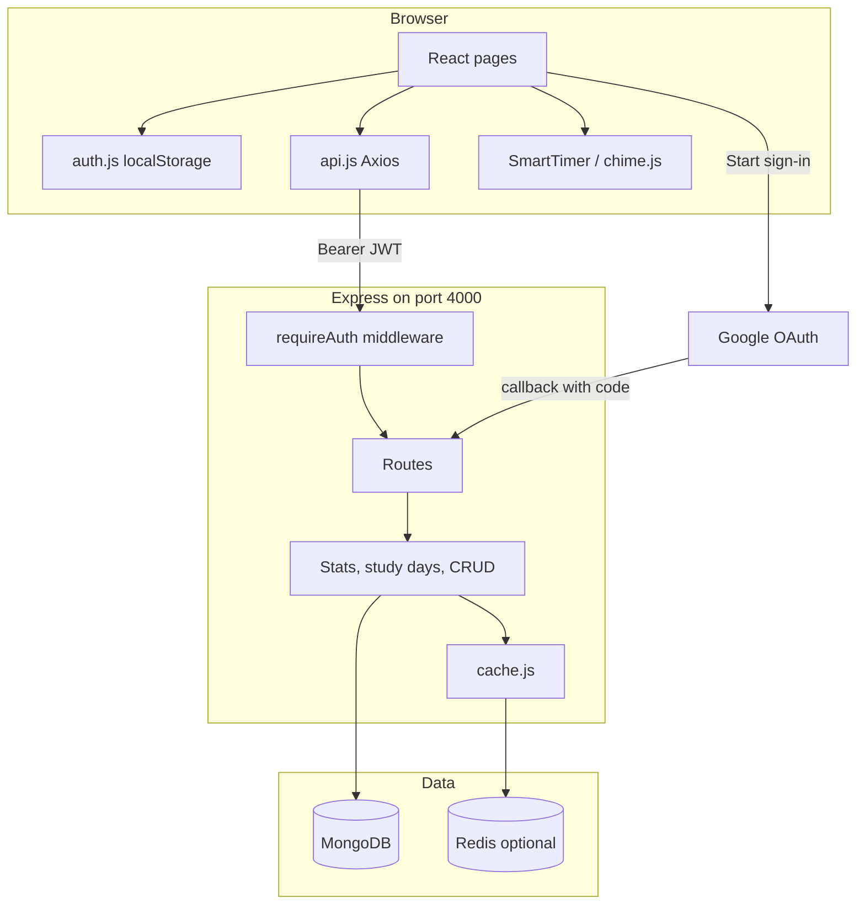
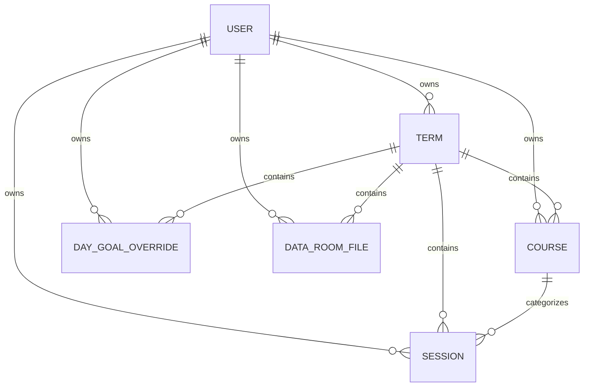

# StudyTrackly — purpose, features, and architecture

This document explains how StudyTrackly works in **beginner-friendly language**. You do not need to be a senior engineer to follow it. Code lives in JavaScript (backend `.js`, frontend `.jsx`). MongoDB with **Mongoose** is the only database.

If you only want to run the app, start with [README.md](README.md).

---

## 1. What is StudyTrackly?

StudyTrackly is a **personal study dashboard**. Students:

1. Sign in with Google.
2. Define an academic **term** (dates + daily study goal).
3. Add **courses** (subjects).
4. Log **sessions** (when they studied and for how long).
5. Review progress on the **dashboard**, **calendar**, and **trophies** pages.

Everything is stored **per user**. User A never sees User B’s sessions.

Think of three layers:

| Layer | Everyday analogy | In this project |
| --- | --- | --- |
| **Frontend** | The shop floor you walk around | React pages in the browser |
| **Backend** | The back office that takes orders | Express API on port 4000 |
| **Database** | The filing cabinet | MongoDB documents (users, terms, sessions, …) |

An optional **Redis** cache is a sticky-note pad for expensive dashboard math. If Redis is missing, the app still works; it just asks MongoDB every time.

---

## 2. Major features (what a student actually does)

### Sign in

- Page: `/signin`
- Button: **Continue with Google**
- First visit creates a User document. Later visits reuse the same Google account.

### Term configuration (`/term-config`)

A **term** is a study period (for example “Fall 2026”) with:

- Start and end dates
- Daily goal in minutes (the API also stores a total hour goal computed from those dates)
- Optional gold / silver / bronze medal counts (shown on Trophies)

Only one term is **active** at a time. Most pages (dashboard, sessions, calendar) use that active term.

### Courses (`/courses`)

Subjects such as “DSA” or “Math”, each with a **color** used in charts and pills. Names must be unique **inside the same term** for the same user.

Deleting a course also deletes that course’s sessions so the UI does not break.

### Sessions (`/sessions`)

A session is one study block:

- Date
- Start and end time (`HH:MM`)
- Break minutes (subtracted from duration)
- Course, optional activity, optional note

Duration is not stored as a separate field; the app computes it as:

`end − start − break` (and wraps past midnight if end is before start).

### Dashboard (`/dashboard`)

Totals (today / week / month), streak, progress through the term, course breakdown, and charts (weekdays, time of day, hours per day by course).

### Calendar (`/calendar`)

- Bar chart of recent days
- A **study days** table: actual minutes, goal, gap (actual − goal), running total of gaps nicknamed **share price**, and progress %
- You can nudge one day’s goal up or down (`/api/study-days/adjust-goal`)

### Data Room (`/data-room`)

Bookmarks: name, URL, note, tied to the active term.

### Trophies (`/trophies`)

Medals and streak based on how many days you met the daily goal.

### Settings (`/settings`)

Display name, email, academic level, SmartTimer volume, ringtone, and how many times the chime repeats.

### SmartTimer (header)

Stopwatch or countdown, fullscreen option. Sounds are **synthesized in the browser** (Web Audio API), not downloaded as MP3s. You can save a finished block as a session.

---

## 3. Technologies (plain English)

| Name | Role |
| --- | --- |
| **React 19** | UI components and pages |
| **Vite** | Dev server and production bundle for the frontend |
| **Tailwind CSS 4** | Styling (dark dashboard look) |
| **React Router 7** | Which page shows for which URL |
| **Axios** | HTTP client; attaches the JWT |
| **Recharts** | Charts |
| **date-fns** | Date formatting on the client |
| **Lucide** | Icons |
| **Node.js + Express** | HTTP server and REST routes (JavaScript ESM: `"type": "module"`) |
| **Mongoose** | Talks to MongoDB with schemas (User, Term, Course, …) |
| **MongoDB Atlas** (or any MongoDB URI) | Permanent storage |
| **jsonwebtoken** | Creates and checks JWT access tokens |
| **google-auth-library** | Google OAuth (redirect + ID token) |
| **Zod** | Validates environment variables and JSON bodies |
| **ioredis** | Optional Redis cache |
| **dotenv** | Loads `backend/.env` |

The frontend and backend are **separate folders**. They are not TypeScript projects. Vite still bundles JSX for the browser.

---

## 4. Complete architecture

### 4.1 Bird’s-eye view



### 4.2 Request path (logged-in user)

1. React calls `api("/api/stats/dashboard")`.
2. Axios adds `Authorization: Bearer <studytrackly_token>` from `localStorage`.
3. In development, Vite forwards `/api` to `localhost:4000`.
4. `requireAuth` verifies the JWT and sets `req.userId`.
5. The route loads that user’s documents from MongoDB (and may read/write Redis).
6. JSON is returned. React updates the page.

If the token is missing or invalid, the API returns **401**. The Axios interceptor clears localStorage so the UI can send you back to sign-in.

### 4.3 Folder map

**Backend** (`backend/src/`)

| Path | Job |
| --- | --- |
| `index.js` | Connects MongoDB, starts Express, mounts `/api/...` |
| `lib/db.js` | `mongoose.connect(MONGO_URI)` |
| `lib/env.js` | Reads and validates `.env` with Zod |
| `lib/redis.js` | Redis client if `REDIS_URL` is set |
| `lib/cache.js` | Get/set/invalidate cache keys per user |
| `lib/date-utils.js` | Calendar days in `Asia/Kolkata` |
| `lib/time.js` / `termGoal.js` / `serialize.js` | Duration math, term hour goals, `_id` → `id` |
| `middleware/auth.js` | JWT check |
| `middleware/errorHandler.js` | 400 for Zod errors, 500 otherwise |
| `models/` | Mongoose schemas |
| `routes/` | One file per resource (auth, terms, courses, sessions, stats, studyDays, settings, dataRoom) |

**Frontend** (`frontend/src/`)

| Path | Job |
| --- | --- |
| `main.jsx` | Mounts React + BrowserRouter |
| `App.jsx` | Routes: guest `/signin`, protected pages inside `AppLayout` |
| `layouts/AppLayout.jsx` | Sidebar + loads settings and dashboard stats |
| `lib/auth.js` | Token in `localStorage`, Google start URL |
| `lib/api.js` | Axios wrapper used by all pages |
| `lib/chime.js` | Timer sounds |
| `pages/` | One screen per feature |
| `components/` | Header, Sidebar, charts, FullscreenTimer |

---

## 5. Database (MongoDB + Mongoose)

MongoDB stores **documents** (JSON-like objects), not SQL tables. Mongoose still gives each collection a **schema** so fields stay consistent.

Every study document includes `userId` so queries are always “this user’s data only.”

### 5.1 How records relate



| Collection (model) | What it stores | Useful indexes |
| --- | --- | --- |
| **User** | Name, email, Google id, timer prefs | Unique email; unique sparse googleId |
| **Term** | Dates, daily goal, medals, `isActive` | `{ userId, startDate }` |
| **Course** | Name + color for a term | Unique `{ userId, termId, name }` |
| **Session** | One study block | `{ userId, termId, date }` |
| **DayGoalOverride** | Custom goal for one `YYYY-MM-DD` | Unique `{ userId, termId, dateKey }` |
| **DataRoomFile** | Link name, URL, note | `{ userId, termId, createdAt }` |

The User schema still has an optional `passwordHash` field for older documents. **Sign-in does not use passwords**; only Google OAuth.

Deleting a **term** also deletes that term’s courses, sessions, day-goal overrides, and data-room links.

### 5.2 IDs in the API

MongoDB uses `_id`. The API often adds `id` as a string (`serialize.js`) so the frontend can use `term.id`, `course.id`, and so on.

---

## 6. Authentication (Google + JWT)

### 6.1 Sign-in dance

1. Browser opens `/api/auth/google` (relative in dev, or `VITE_API_URL` + path in production).
2. Express redirects to Google with a short-lived **state** JWT (CSRF protection).
3. After you approve, Google hits `/api/auth/google/callback?code=...&state=...`.
4. The API exchanges the code, reads email and Google `sub`, finds or creates a User.
5. The API issues a **JWT** whose `sub` is the Mongo user id.
6. The browser is redirected to  
   `FRONTEND_URL/auth/callback#token=...&user=...`
7. `AuthCallbackPage` saves token + user in `localStorage` and goes to `/dashboard`.

### 6.2 Later requests

`requireAuth` expects:

```http
Authorization: Bearer <jwt>
```

It sets `req.userId`. Routes filter MongoDB with that id.

Public (no JWT): `GET /api/health` and `/api/auth/*`.

### 6.3 Frontend gates

- **GuestRoute**: if you already have a token, `/signin` sends you to the dashboard.
- **ProtectedRoute**: no token → `/signin`.
- Layout loads `/api/settings` and `/api/stats/dashboard` once you are signed in.

---

## 7. Important backend logic (still in simple terms)

### 7.1 Daily “share price” (calendar)

For each day in the term:

- **Duration** = minutes studied that day  
- **Goal** = term daily goal, unless you overrode that date  
- **Gap** = duration − goal  
- **Share price** = running sum of gaps from the start of the term  

Ahead of plan → share price climbs. Behind → it falls. Implemented in `backend/src/routes/studyDays.js`. Dates use the **Asia/Kolkata** timezone helpers in `date-utils.js`.

### 7.2 Streaks (`stats.js`)

- **Current streak**: consecutive days with at least one session, ending today (or yesterday if you have not logged today yet).
- **Best streak**: longest such run in the term.

### 7.3 Dashboard aggregations

Sessions are grouped without extra databases:

- **Weekday radar**: Sunday = 0 … Saturday = 6  
- **Time buckets**: night 00:00–05:59, morning 06:00–11:59, afternoon 12:00–17:59, evening 18:00–23:59 (from `startTime`)  
- **Daily stacked chart**: hours per day split by course color/name  

### 7.4 Redis cache (optional)

Heavy stats are stored under keys like:

`st:<userId>:stats:<url>`

Typical TTL is about 30–60 seconds. When you create/update/delete sessions, courses, or terms, the API **invalidates** that user’s cache keys with Redis `SCAN` (not a global flush). If `REDIS_URL` is empty, every request hits MongoDB.

---

## 8. Frontend architecture

### 8.1 Pages and layout

Logged-in screens share a **sidebar** and **header** (`AppLayout`). The header can show term context and the SmartTimer.

```
┌──────────┬─────────────────────────────┐
│ Sidebar  │ Header (timer, title)       │
│ Dashboard│                             │
│ Sessions │  Page content (charts,      │
│ Courses  │  tables, forms)             │
│ Calendar │                             │
│ …        │                             │
└──────────┴─────────────────────────────┘
```

### 8.2 API helper

`frontend/src/lib/api.js` wraps Axios:

- Sets JSON content type  
- Attaches the JWT  
- On 401, clears auth  

Pages still pass `fetch`-style `{ method, body: JSON.stringify(...) }` into `api()`.

### 8.3 Timer audio

`chime.js` builds tones with oscillators (soft chime, alert beep, zen gong, digital alarm, and others). Volume and repeat count come from Settings.

---

## 9. Environment variables (backend)

| Variable | Required? | Meaning |
| --- | --- | --- |
| `MONGO_URI` | Yes | MongoDB connection string |
| `JWT_SECRET` | Yes | Secret used to sign tokens (long random string) |
| `JWT_EXPIRES_IN` | No | Default `7d` |
| `PORT` | No | Default `4000` |
| `GOOGLE_CLIENT_ID` / `GOOGLE_CLIENT_SECRET` | For sign-in | Web OAuth client |
| `GOOGLE_CALLBACK_URL` | Should match Google Cloud | Exact redirect URI |
| `FRONTEND_URL` | Yes for OAuth redirect back to the UI | e.g. `http://localhost:5173` |
| `CORS_ORIGIN` | If UI and API are on different domains | Comma-separated origins |
| `REDIS_URL` | No | Enable Redis cache |

Frontend (build time): `VITE_API_URL` if the static site is not on the same host as the API.

---

## 10. How to run (short)

```bash
# Terminal 1
cd backend && npm install && npm run dev

# Terminal 2
cd frontend && npm install && npm run dev
```

Open [http://localhost:5173](http://localhost:5173). Health check: [http://localhost:4000/api/health](http://localhost:4000/api/health).

More setup (Google Cloud, production) is in [README.md](README.md).

---

## 11. Design choices worth remembering

- **JavaScript only** for app source; no TypeScript compile step for the API (`npm start` runs `src/index.js`).
- **MongoDB + Mongoose only** — no Prisma, no SQLite.
- **Per-user isolation** on every study collection.
- **Computed durations and stats** rather than storing redundant totals.
- **Redis is an accelerator**, not a second source of truth.
